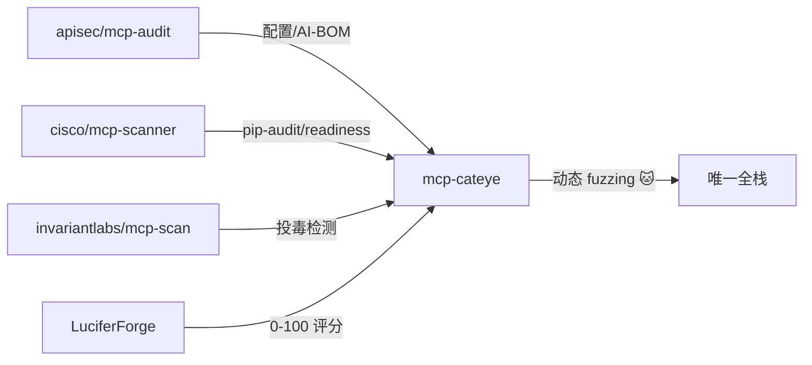

# 🐱 mcp-cateye

**MCP 服务器安全扫描器** — 动态模糊测试 + 静态分析。猫的眼睛能看到别人忽略的东西。

[English](README.md) | [中文](README.zh.md)

[](https://pypi.org/project/mcp-cateye/)
[](https://pypi.org/project/mcp-cateye/)
[](https://opensource.org/licenses/MIT)

## 简介

> 🐱 **mcp-cateye** 是一款 MCP（Model Context Protocol）服务器安全扫描器，结合**动态模糊测试**和**静态分析**两大引擎。
>
> 市面上大多数 MCP 安全工具只做静态分析或只做配置扫描。mcp-cateye 是唯一同时支持**主动 fuzzing** + **静态审计** + **AI-BOM 生成**的工具。

## 核心能力

- 🔴 **动态 Fuzzing** — 50+ 攻击载荷，9 大类（命令注入/路径穿越/SSRF/提示词注入/SQL/XSS/模板注入/信息泄露/反序列化）
- 🔍 **配置发现** — 扫描 Claude Desktop / Cursor / VS Code / Windsurf / Zed / Cline 等客户端的 MCP 配置
- 🔑 **密钥检测** — OpenAI、GitHub、AWS、Slack、JWT、私钥、数据库连接串
- 🛡️ **工具描述分析** — 检测投毒（poisoning）、rug pull、提示词注入、过度授权
- 📦 **依赖漏洞** — pip-audit 集成，扫描已知 CVE
- 🏗️ **代码就绪度** — AST 分析，检测缺失 timeout、`shell=True`、裸 except
- 🎯 **安全评分** — 0-100 分 + A-F 等级，分类别展示扣分
- 📋 **AI-BOM** — CycloneDX 1.5 JSON 格式的物料清单

## 竞品对比



| 工具 | 长处 | cateye 是否包含 |
|------|------|----------------|
| [apisec/mcp-audit](https://github.com/apisec-inc/mcp-audit) | 配置发现、密钥检测、AI-BOM | ✅ 全部包含 |
| [cisco/mcp-scanner](https://github.com/cisco-ai-defense/mcp-scanner) | pip-audit 集成、就绪度检查 | ✅ 两项都包含 |
| [invariantlabs/mcp-scan](https://github.com/invariantlabs-ai/mcp-scan) | 工具描述投毒检测 | ✅ `analyze_tool_descriptions` |
| [LuciferForge/mcp-security-audit](https://github.com/LuciferForge/mcp-security-audit) | 0-100 评分带字母等级 | ✅ `calculate_score` + A-F 等级 |
| [mcpserver-audit](https://github.com/ModelContextProtocol-Security/mcpserver-audit) | CSA 项目、audit-db 发布 | 🔜 路线图（v1.2） |
| **mcp-cateye** | **主动 fuzzing** | 🐱 **唯一支持 fuzzing 的工具** |

**mcp-cateye 是唯一同时拥有 动态 fuzzing + 静态分析 + 评分 + AI-BOM 的工具。**

## 安装

### 从 GitHub 安装（推荐）
```bash
pip install git+https://github.com/test008008008008-glitch/mcp-cateye.git
```

### 从 PyPI 安装（即将支持）
```bash
pip install mcp-cateye
```

### 从源码安装
```bash
git clone https://github.com/test008008008008-glitch/mcp-cateye
cd mcp-cateye
pip install -e .
```

**需要 Python 3.10+**

## 快速开始

### Fuzz 一个 MCP 服务器
```bash
# Fuzz 所有工具
mcp-cateye fuzz python -- -m my_mcp_server

# Fuzz 特定类别
mcp-cateye fuzz -c cmd -c ssrf node -- server.js

# JSON 输出（CI/CD 集成）
mcp-cateye fuzz --json python -- server.py
```

### 静态分析
```bash
# 完整扫描
mcp-cateye scan .

# 快速安全评分
mcp-cateye score .

# 生成 AI-BOM
mcp-cateye scan . --aibom

# 扫描特定客户端
mcp-cateye scan . --clients claude --clients cursor
```

### 列出工具和载荷
```bash
# 列出服务器暴露的工具
mcp-cateye list-tools python -- -m my_mcp_server

# 列出所有可用载荷
mcp-cateye list-payloads
```

## 安全评分

`score` 命令给出 0-100 快速评分：

```
🐱 mcp-cateye — 安全评分

  🟡 B+  [██████████████████████░░░░░░░░]  72/100

  分类评分:
    fuzzing              [████████████████████] 100/100
    secrets              [██████████░░░░░░░░░░]  50/100
    dependencies         [████████████████████] 100/100
    tool_descriptions    [██████████████░░░░░░]  70/100
    readiness            [████████████████░░░░]  80/100
```

## 攻击载荷分类

| 类别 | 数量 | 示例 |
|------|------|------|
| 命令注入 | 8 | `$(whoami)`、反引号、`os.system` |
| 路径穿越 | 6 | `../../etc/passwd`、null bytes |
| SSRF | 6 | `http://169.254.169.254`、DNS rebinding |
| 提示词注入 | 7 | 忽略指令、角色劫持 |
| SQL 注入 | 6 | Union、盲注、时延 |
| XSS | 5 | script 标签、事件处理器 |
| 模板注入 | 5 | Jinja2、Twig、Freemarker |
| 信息泄露 | 4 | 堆栈跟踪、debug 端点 |
| 反序列化 | 4 | Pickle、YAML unsafe |

## CI/CD 集成

```yaml
# GitHub Actions
- name: Security Scan
  run: |
    pip install mcp-cateye
    mcp-cateye scan . --json > report.json
    mcp-cateye score .
```

退出码：
- `0` — 无 critical 漏洞
- `1` — 检测到 critical 漏洞

## 为什么选 mcp-cateye？

大多数 MCP 安全工具只做静态分析。mcp-cateye 是唯一同时提供以下能力的工具：

1. **主动 fuzzing** — 真的把恶意载荷发到 MCP 服务器
2. **静态分析** — 扫描配置、代码和依赖
3. **安全评分** — 一个数字就能追踪

## 许可证

MIT
